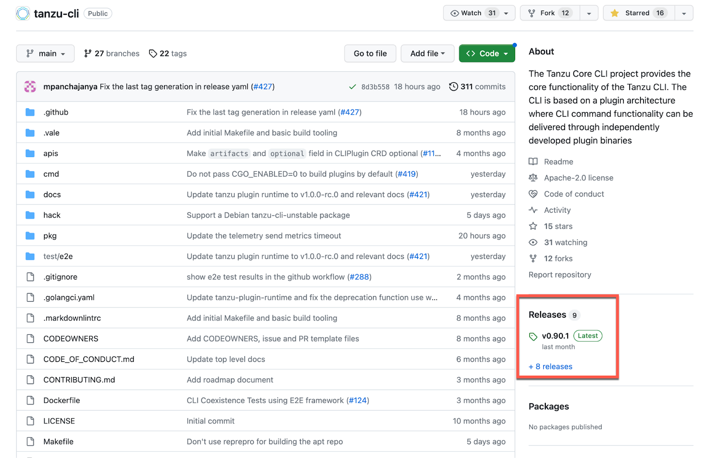
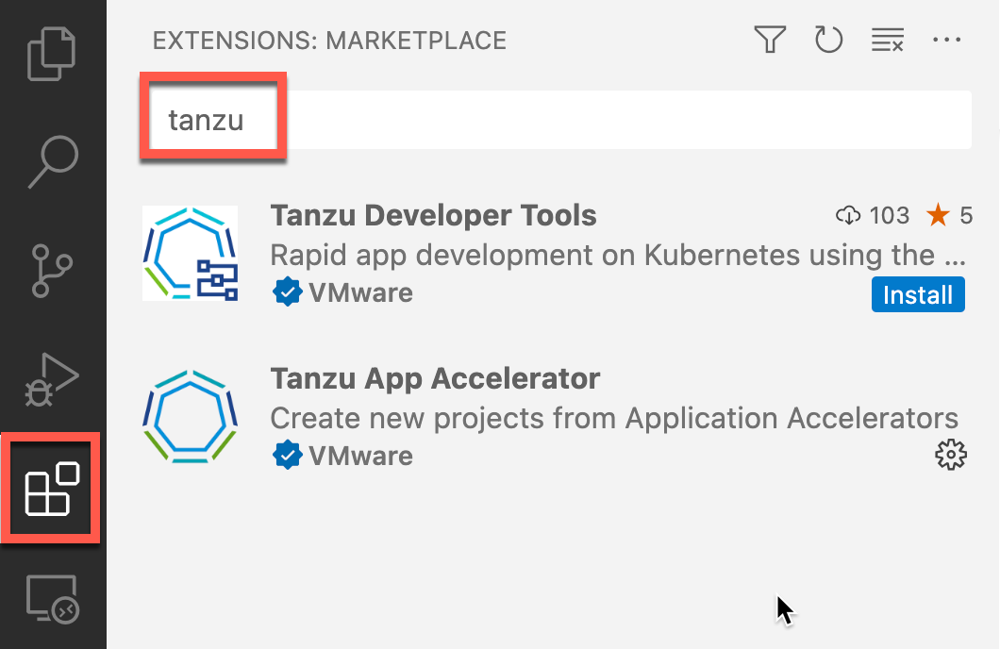
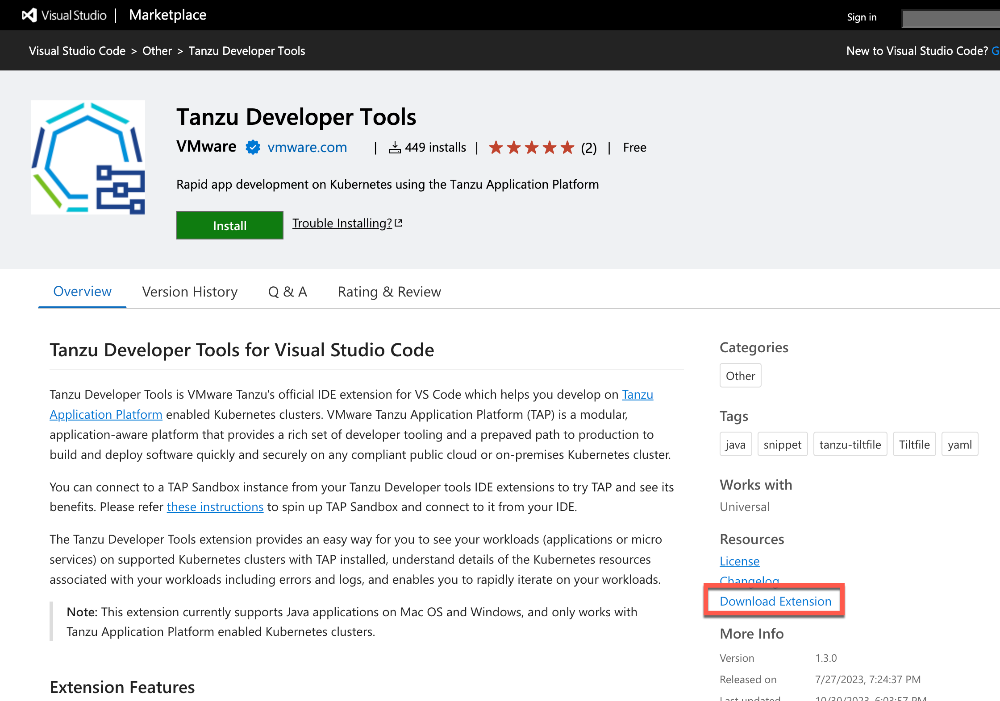
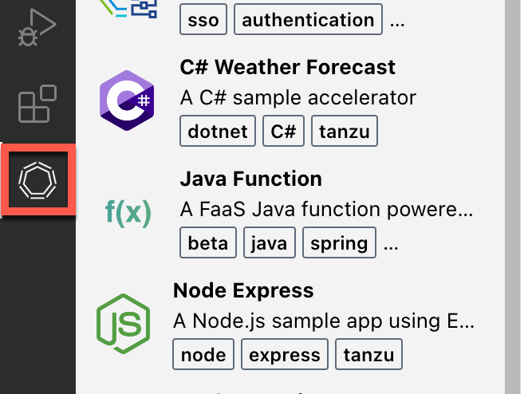
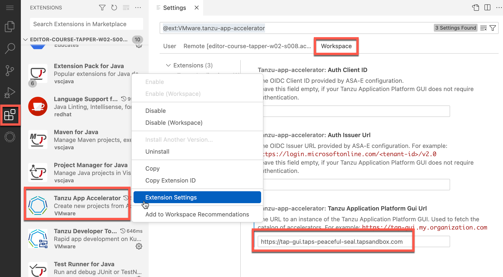
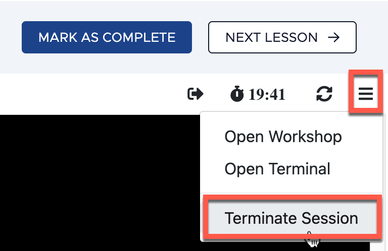

###########################################################
Configuring your workstation for Tanzu Application Platform
###########################################################
.. sectnum::
    :suffix: .
    :start: 1
    :depth: 3

************
Introduction
************

Overall Lab Goals
=================

As an application developer, you want to quickly deploy and run a containerized application on Tanzu Application Platform.

As a platform operator, you want to manage TAP clusters and the supply chains that deliver the software to the clusters.

To get started, you want to configure your local workstation with the required tools.

In this lab, you will learn how to configure a workstation by installing a set of Tanzu tools to help you deploy, test, and troubleshoot code changes to a Kubernetes cluster running Tanzu Application Platform.

Prerequisites:
==============

While there are no prerequisites for this lab, you should be comfortable working at the command prompt/terminal.

Target audience:
==============

Platform operators, developers, or anyone with an interest in Tanzu Application Platform.

Lab Environment
===============

The lab environment provides you with a Fedora Linux workstation. It does not come with access to a Kubernetes cluster where TAP is installed.

The actual installation commands and steps may vary depending on your operating system. Always refer to the documentation for the latest instructions.

What to Install
===============

Here's a quick list of tools to work with Tanzu Application Platform.

* `Kubernetes CLI <https://kubernetes.io/docs/tasks/tools/>`_
* `Tanzu CLI <https://docs.vmware.com/en/VMware-Tanzu-Application-Platform/1.7/tap/install-tanzu-cli.html>`_
* `Tanzu CLI plugins <https://docs.vmware.com/en/VMware-Tanzu-Application-Platform/1.7/tap/install-tanzu-cli.html#install-tanzu-cli-plugins-5>`_

Optionally, you can also install:

* Tanzu IDE extensions for `Visual Studio Code <https://docs.vmware.com/en/VMware-Tanzu-Application-Platform/1.7/tap/vscode-extension-about.html>`_, `IntelliJ <https://docs.vmware.com/en/VMware-Tanzu-Application-Platform/1.7/tap/intellij-extension-about.html>`_, and `Visual Studio <https://docs.vmware.com/en/VMware-Tanzu-Application-Platform/1.7/tap/vs-extension-about.html>`_
* `Tilt <https://tilt.dev/>`_
  
.. note::

  The above links pointing to the Tanzu documentation are pointing to TAP version 1.7 which is the latest version at the time of writing. You can use the version selector at the top of the pages to select a different version.

  .. image:: images/tapversionselection.png
    :class: screenshot

**************
Kubernetes CLI
**************

The Tanzu CLI has a dependency on the Kubernetes CLI (``kubectl``). No worries if you don't know how to use Kubernetes. You usually will not need to use the Kubernetes CLI as you will use the Tanzu CLI instead as it provides a simpler interface for working with Kubernetes.

There are many ways to install ``kubectl``. Refer to the `Kubernetes documentation <https://kubernetes.io/docs/tasks/tools/>`_ for the latest instructions.

There's no need to install ``kubectl`` in the lab environment.

*********
Tanzu CLI
*********

The bare minimum that you need to use TAP from a workstation is the Tanzu CLI. It's a command line interface that you run locally and connects you to a TAP cluster. For example, you can use the Tanzu CLI to:

* Configure the Tanzu CLI itself.
* Create and manage application workloads from source code or container images.
* Deploy code updates.

You can install the Tanzu CLI using a package manager like **Homebrew** and **Chocolatey**.

Homebrew (MacOS)
================

.. code-block:: bash

  brew update
  brew install vmware-tanzu/tanzu/tanzu-cli

Chocolatey (Windows)
====================

.. code-block:: bash

  choco install tanzu-cli

Linux
=====

For installing using APT (Debian or Ubuntu), YUM or DNF (RHEL), please refer to the `documentation <https://docs.vmware.com/en/VMware-Tanzu-Application-Platform/1.7/tap/install-tanzu-cli.html>`_ for the latest instructions.

GitHub
======

The Tanzu CLI is also available from a `GitHub repository <https://github.com/vmware-tanzu/tanzu-cli>`_.

.. container:: web

  `Click <https://github.com/vmware-tanzu/tanzu-cli>`_ the link will open a new browser tab and display the Tanzu CLI GitHub repository.  
  
In the repository page, locate the **Releases** section in the right column. You'll be able to list all available versions and download the one for your operating system.

Take note of the latest version number, you'll need it in a moment.

Click on the **Terminal** tab to display the terminal.

.. container:: run

  Since the lab environment runs Fedora Linux, you can install the Tanzu CLI using the following commands replacing the version number with the latest one:

.. code-block:: bash
    
  # Set the Tanzu CLI version number
  export TANZU_CLI_VERSION="v1.1.0" 
  # Create the bin directory  
  mkdir -p ${HOME}/.local/bin  
  # Add the bin directory to the PATH  
  export PATH=${PATH}:${HOME}/.local/bin  
  # Download the Tanzu CLI  
  curl -L https://github.com/vmware-tanzu/tanzu-cli/releases/download/${TANZU_CLI_VERSION}/tanzu-cli-linux-amd64.tar.gz -o tanzu-cli-linux-amd64.tar.gz
  # Extract the Tanzu CLI  
  tar -zxvf tanzu-cli-linux-amd64.tar.gz  
  # Move the Tanzu CLI to the bin directory  
  mv ${HOME}/${TANZU_CLI_VERSION}/tanzu-cli-linux_amd64 ${HOME}/.local/bin/tanzu

.. container:: run
    
    Display the Tanzu CLI version number using:

.. code-block:: bash

    tanzu version

Auto-completion
===============

The Tanzu CLI offers an auto-completion feature that help you type commands faster.

.. container:: run

  Use the help feature to see how to enable it in different shells:

.. code-block:: bash

  tanzu completion --help

.. container:: run

  Enable auto-completion for the current shell session using:

.. code-block:: bash

  source <(tanzu completion bash)

.. container:: run

  You can also enable auto-completion for all new sessions using:

.. code-block:: bash

  tanzu completion bash > $HOME/.config/tanzu/completion.bash.inc
  printf "\n# Tanzu shell completion\nsource '$HOME/.config/tanzu/completion.bash.inc'\n" >> $HOME/.bashrc

Tanzu CLI Plugins
=================

Plugins extend the functionalities offered by the Tanzu CLI.

.. container:: run
    
    List the Tanzu plugins installed using:

.. code-block:: bash

    tanzu plugin list

By default, no plugins are pre-installed.

.. container:: run
    
    Install the ``accelerator`` and the ``apps`` plugins using:

.. code-block:: bash

    tanzu plugin install accelerator
    tanzu plugin install apps

.. container:: run
    
    List the plugins again:

.. code-block:: bash

    tanzu plugin list

In the **STATUS** column, you see which ones are installed. 
 
The **accelerator** plugin allows you to publish a project template as an accelerator and the **apps** plugin allows you to manage (deploy, update, delete) a workload on a TAP cluster. Other plugins are available to manage the Tanzu CLI configuration, the Tanzu Developer Portal, and the Tanzu Build Service.

********************
Tanzu IDE extensions
********************

While using the command line is convenient and allows you to deploy and manage applications to TAP clusters, developers will likely be using a code editor or an IDE to code apps. Wouldn't it be nice if you could deploy your apps directly from inside your code editor without having to use the command line? Well, thanks to the plugins and extensions available from Tanzu, you can do exactly that. Tanzu offers plugins/extension for the following code editors/IDEs:

* IntelliJ
* Visual Studio Code (the lightweight editor)
* Visual Studio (the full blown Microsoft IDE)

To avoid confusion, the lab instructions will use **VS Code** to refer to **Visual Studio Code**.

.. note::

    The Tanzu Developer Tools extension for Visual Studio is only supported on Windows and with the C# language.

VS Code Marketplace
===================

Starting with TAP 1.6, the Tanzu extensions are available directly from the **VS Code Marketplace**.

The lab environment has VS Code already installed. Click on the **Editor** tab to display it.

.. container:: web

  In VS Code, click on the **Extension** icon in the left menu and type ``tanzu`` in the search box.

The above screenshot shows the expected result however, there's nothing in the lab environment. Why is this so? The lab environment uses a special version of VS Code called **Code Server** that runs in a browser and use a different marketplace where the Tanzu extensions are currently not available but there's a workaround: You will download and install the extensions using **VSIX** files.

VSIX Files
==========

VS Code extensions are packaged as **VSIX** files that you can download from the `VS Code Marketplace <https://marketplace.visualstudio.com/vscode>`_.

.. container:: web

  * Click on the `VS Code Marketplace <https://marketplace.visualstudio.com/vscode>`_ link to open a new browser tab and display the VS Code Marketplace.
  * Search to ``tanzu``.
  * Click on the **Tanzu Developer Tools** extension.
  * Locate the **Download Extension** link.

This is how you'd download the extension as a VSIX file however, for this lab you will use a script that will download and install both extensions.

Click on the **Terminal** tab.

.. container:: run
    
    Run the following script:

.. literalinclude:: code/install-vscode-extensions.sh
  :language: bash

Click on the **Editor** tab.

Validate that the **Tanzu App Accelerator** extension is working. 

.. container:: web

  Click on the **Tanzu App Accelerator** icon in the left menu. You should get an error as the extension has not been configured yet. The screenshot below displays the expected result when the extension is properly configured.

How does the extension retrieve the accelerators list? It does by connecting to a TAP cluster using the Tanzu Developer Portal API so you need to provide the extension with the TAP Portal URL.

In a real life scenario, the platform operations team would provide you with the URL to use. You would then set the value in the extension settings.

Here's how you would do it:

.. container:: web
  
  Set the TAP Portal URL by following these steps:

  * Click on the **Extensions** icon in the left menu.
  * Clear the search box if needed.
  * Locate the **Tanzu App Accelerator** extension.
  * Click on the **Gear** icon.
  * From the context menu, select **Extension Settings**.
  * Locate the **Tanzu App Accelerator Server URL** setting.

Since you don't have access to a TAP cluster from the lab environment, you won't be able to configure the extension.

Tilt
====

TAP allows developers to quickly test code changes by automatically deploying them to the TAP cluster. This feature is called **Tanzu Live Update** and it relies on **Tilt**. Tilt is an open-source tool that watches for changes in the file system.

.. note::

  Tanzu Live Update can be used with the Tanzu CLI and with the Tanzu Developer Tools extension in VS Code and IntelliJ.

.. container:: web

  You can download it from the `Tilt Website <https://tilt.dev/>`_. If you're curious about Tilt, click the link to display the Tilt website. You can then close the browser tab displaying the Tilt website.

Click on the **Terminal** tab.

.. container:: run
    
    Run the installation script using:

.. code-block:: bash
    
  curl -fsSL https://raw.githubusercontent.com/tilt-dev/tilt/master/scripts/install.sh | bash
  echo "export PATH=${PATH}:${HOME}/.local/bin" >> ${HOME}/.bash_profile

.. container:: run
    
    Validate that Tilt is installed by typing:

.. code-block:: bash

    tilt

Tilt will display a list of available commands. This confirms that Tilt is installed.

**********
Conclusion
**********

Congratulations! You just learned how to configure a workstation by downloading the required Tanzu tools.

You can now close the lab by clicking on the menu button on the top right of the page and selecting **Terminate Session**. You'll be asked to confirm. Then, you can mark the lab as complete using the **MARK AS COMPLETE** button.

